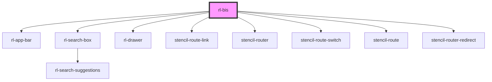

# rl-bis

<!-- Auto Generated Below -->

## Properties

| Property  | Attribute | Description | Type                         | Default     |
| --------- | --------- | ----------- | ---------------------------- | ----------- |
| `history` | --        |             | `RouterHistory \| undefined` | `undefined` |

## Dependencies

### Depends on

- [rl-app-bar](../components/app-bar)
- [rl-search-box](../components/search-box)
- [rl-drawer](../components/drawer)
- stencil-route-link
- stencil-router
- stencil-route-switch
- stencil-route
- stencil-router-redirect

### Graph

----------------------------------------------

*Built with [StencilJS](https://stenciljs.com/)*
