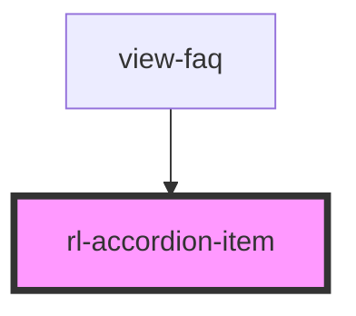

# rl-accordion-item

<!-- Auto Generated Below -->

## Properties

| Property | Attribute | Description                                                                                          | Type      | Default |
| -------- | --------- | ---------------------------------------------------------------------------------------------------- | --------- | ------- |
| `delay`  | `delay`   | A delay used to fade-in this item a specific amount of time after the component is rendered.         | `number`  | `0`     |
| `index`  | `index`   | An index number used to reference this item in the larger list of all items in the parent accordion. | `number`  | `0`     |
| `isOpen` | `is-open` | A state tracking the current open/closed state of this item.                                         | `boolean` | `false` |

## Events

| Event           | Description                                                      | Type               |
| --------------- | ---------------------------------------------------------------- | ------------------ |
| `afterCollapse` | Event emitted after the body's collapse animation has completed. | `CustomEvent<any>` |
| `afterExpand`   | Event emitted after the body's expand animation has completed.   | `CustomEvent<any>` |
| `closed`        | Event emitted when the item is closed.                           | `CustomEvent<any>` |
| `opened`        | Event emitted when the item is opened.                           | `CustomEvent<any>` |

## Methods

### `close() => Promise<void>`

Close the `accordion-item`.

#### Returns

Type: `Promise<void>`

### `open() => Promise<void>`

Open the `accordion-item`.

#### Returns

Type: `Promise<void>`

## Dependencies

### Used by

 - [view-faq](../../views/view-faq)

### Graph

----------------------------------------------

*Built with [StencilJS](https://stenciljs.com/)*
