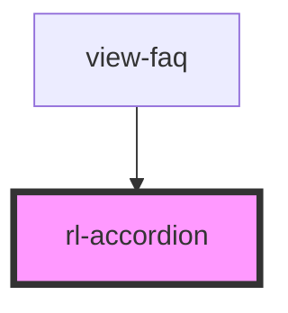

# rl-expansion-panel

<!-- Auto Generated Below -->

## Properties

| Property        | Attribute        | Description                                                                          | Type                           | Default |
| --------------- | ---------------- | ------------------------------------------------------------------------------------ | ------------------------------ | ------- |
| `allowMultiple` | `allow-multiple` | Flag indicating if multiple `accordion-item`s can be open at once. Defaults to true. | `boolean`                      | `false` |
| `items`         | --               | An array of content displayed by the accordion.                                      | `{ [key: string]: string; }[]` | `[]`    |

## Dependencies

### Used by

 - [view-faq](../../views/view-faq)

### Graph

----------------------------------------------

*Built with [StencilJS](https://stenciljs.com/)*
