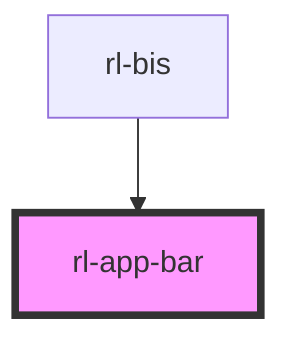

# rl-app-bar

<!-- Auto Generated Below -->

## Properties

| Property        | Attribute        | Description                                                                                                                         | Type                                                                              | Default |
| --------------- | ---------------- | ----------------------------------------------------------------------------------------------------------------------------------- | --------------------------------------------------------------------------------- | ------- |
| `appTitle`      | `app-title`      | The current width of the application.  Used to determine what kind of interface should be displayed (reduced or full-width layout). | `string`                                                                          | `''`    |
| `centerTitle`   | `center-title`   |                                                                                                                                     | `boolean`                                                                         | `false` |
| `dense`         | `dense`          |                                                                                                                                     | `boolean`                                                                         | `false` |
| `singleSection` | `single-section` |                                                                                                                                     | `boolean`                                                                         | `false` |
| `type`          | `type`           |                                                                                                                                     | `"" \| "fixed" \| "prominent" \| "prominentFixed" \| "short" \| "shortCollapsed"` | `''`    |

## Events

| Event                   | Description                                                 | Type               |
| ----------------------- | ----------------------------------------------------------- | ------------------ |
| `menuClicked`           | Event fired when the menu button on the app bar is clicked. | `CustomEvent<any>` |
| `searchFaqClicked`      |                                                             | `CustomEvent<any>` |
| `searchLocationClicked` |                                                             | `CustomEvent<any>` |

## Dependencies

### Used by

 - [rl-bis](../../app)

### Graph

----------------------------------------------

*Built with [StencilJS](https://stenciljs.com/)*
