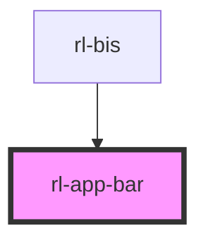

# rl-app-bar

<!-- Auto Generated Below -->

## Properties

| Property        | Attribute        | Description                                                                                  | Type                                                                              | Default |
| --------------- | ---------------- | -------------------------------------------------------------------------------------------- | --------------------------------------------------------------------------------- | ------- |
| `centerTitle`   | `center-title`   | Center the title within the `app-bar`.                                                       | `boolean`                                                                         | `false` |
| `dense`         | `dense`          | Use dense bar styling (reduced height).                                                      | `boolean`                                                                         | `false` |
| `singleSection` | `single-section` | Use one single section to hold all buttons and the title rather than three distinc sections. | `boolean`                                                                         | `false` |
| `type`          | `type`           | The type of this `app-bar` used to determine style and function.                             | `"" \| "fixed" \| "prominent" \| "prominentFixed" \| "short" \| "shortCollapsed"` | `''`    |

## Events

| Event         | Description                                                 | Type               |
| ------------- | ----------------------------------------------------------- | ------------------ |
| `menuClicked` | Event fired when the menu button on the app bar is clicked. | `CustomEvent<any>` |

## Dependencies

### Used by

 - [rl-bis](../../app)

### Graph

----------------------------------------------

*Built with [StencilJS](https://stenciljs.com/)*
