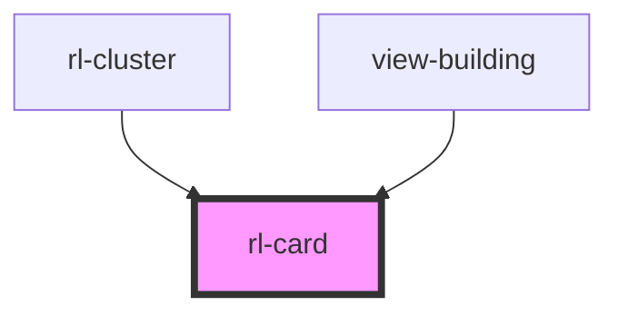

# rl-card

<!-- Auto Generated Below -->

## Properties

| Property           | Attribute            | Description | Type                                             | Default                    |
| ------------------ | -------------------- | ----------- | ------------------------------------------------ | -------------------------- |
| `buttons`          | --                   |             | `undefined \| { name: string; link: string; }[]` | `undefined`                |
| `cardColor`        | --                   |             | `Color`                                          | `new Color(255, 255, 255)` |
| `cardMedia`        | `card-media`         |             | `string`                                         | `''`                       |
| `cardTitle`        | `card-title`         |             | `string`                                         | `''`                       |
| `hasPrimaryAction` | `has-primary-action` |             | `boolean`                                        | `false`                    |
| `history`          | --                   |             | `RouterHistory \| undefined`                     | `undefined`                |
| `icons`            | --                   |             | `undefined \| { name: string; link: string; }[]` | `undefined`                |
| `mediaSize`        | `media-size`         |             | `"contain" \| "cover"`                           | `'cover'`                  |
| `noContent`        | `no-content`         |             | `boolean`                                        | `false`                    |
| `noMedia`          | `no-media`           |             | `boolean`                                        | `false`                    |
| `primaryLink`      | `primary-link`       |             | `string`                                         | `''`                       |
| `titleInMedia`     | `title-in-media`     |             | `boolean`                                        | `false`                    |
| `wideMediaAspect`  | `wide-media-aspect`  |             | `boolean`                                        | `false`                    |

## Dependencies

### Used by

 - [rl-cluster](../cluster)
 - [view-building](../../views/view-building)

### Graph

----------------------------------------------

*Built with [StencilJS](https://stenciljs.com/)*
