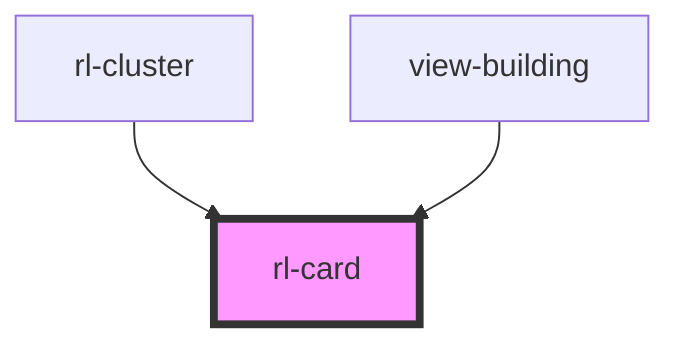

# rl-card

<!-- Auto Generated Below -->

## Properties

| Property           | Attribute            | Description                                                                                                                                     | Type                                             | Default                    |
| ------------------ | -------------------- | ----------------------------------------------------------------------------------------------------------------------------------------------- | ------------------------------------------------ | -------------------------- |
| `buttons`          | --                   | The action buttons displayed at the bottom-left of the card                                                                                     | `undefined \| { name: string; link: string; }[]` | `undefined`                |
| `cardColor`        | --                   | The color of the card.                                                                                                                          | `Color`                                          | `new Color(255, 255, 255)` |
| `cardMedia`        | `card-media`         | URL of an image to display as the media.  If no media is specified a placeholder will be used.                                                  | `string`                                         | `''`                       |
| `cardTitle`        | `card-title`         | The title of the card                                                                                                                           | `string`                                         | `''`                       |
| `hasPrimaryAction` | `has-primary-action` | Flag indicating if the entire card is a clickable element.  This does not include any buttons or icons.                                         | `boolean`                                        | `false`                    |
| `history`          | --                   | The Stencil history object, used to programmatically navigate.                                                                                  | `RouterHistory \| undefined`                     | `undefined`                |
| `icons`            | --                   | The action icons displayed at the bottom-right of the card.                                                                                     | `undefined \| { name: string; link: string; }[]` | `undefined`                |
| `mediaSize`        | `media-size`         | Media sizing rule.                                                                                                                              | `"contain" \| "cover"`                           | `'cover'`                  |
| `noContent`        | `no-content`         | Flag indicating if the card does not have any content.                                                                                          | `boolean`                                        | `false`                    |
| `noMedia`          | `no-media`           | Flag indicating if the card does not use media.  This means no media or media placeholder should be displayed.                                  | `boolean`                                        | `false`                    |
| `primaryLink`      | `primary-link`       | The link to use for the primary card action.                                                                                                    | `string`                                         | `''`                       |
| `titleInMedia`     | `title-in-media`     | Flag indicating if the title is displayed over top of the media (with text protection for legibility), or underneath the media on its own line. | `boolean`                                        | `false`                    |
| `wideMediaAspect`  | `wide-media-aspect`  | Use a wide or square aspect ratio for the media.                                                                                                | `boolean`                                        | `false`                    |

## Dependencies

### Used by

 - [rl-cluster](../cluster)
 - [view-building](../../views/view-building)

### Graph

----------------------------------------------

*Built with [StencilJS](https://stenciljs.com/)*
