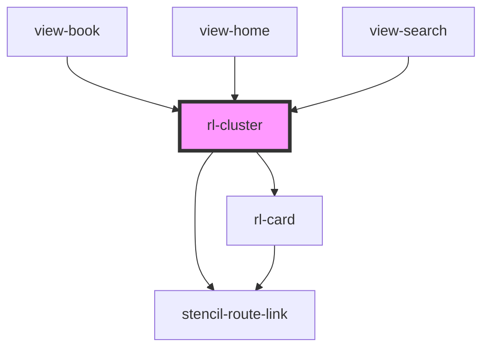

# rl-cluster

<!-- Auto Generated Below -->

## Properties

| Property  | Attribute  | Description | Type                  | Default     |
| --------- | ---------- | ----------- | --------------------- | ----------- |
| `columns` | `columns`  |             | `number`              | `5`         |
| `data`    | `data`     |             | `any`                 | `undefined` |
| `hasMore` | `has-more` |             | `boolean`             | `false`     |
| `heading` | `heading`  |             | `string`              | `''`        |
| `type`    | `type`     |             | `string \| undefined` | `undefined` |

## Dependencies

### Used by

 - [view-book](../../views/view-book)
 - [view-home](../../views/view-home)
 - [view-search](../../views/view-search)

### Depends on

- [rl-card](../card)
- stencil-route-link

### Graph

----------------------------------------------

*Built with [StencilJS](https://stenciljs.com/)*
