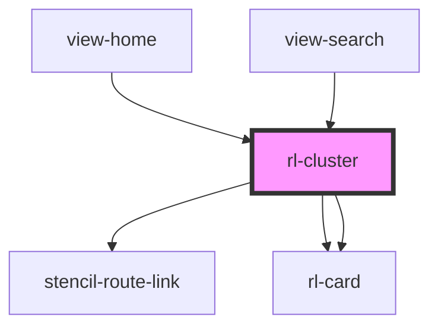

# rl-cluster

<!-- Auto Generated Below -->

## Properties

| Property   | Attribute   | Description                                                                                                                                                          | Type                         | Default     |
| ---------- | ----------- | -------------------------------------------------------------------------------------------------------------------------------------------------------------------- | ---------------------------- | ----------- |
| `columns`  | `columns`   | The number of columns the cluster has.  This only effects lane and grid clusters.                                                                                    | `number`                     | `2`         |
| `data`     | --          | The array of data displayed in the cluster.                                                                                                                          | `ClusterData[] \| undefined` | `undefined` |
| `hasMore`  | `has-more`  | A flag indicating if a 'See All' button should be displayed, taking the user to a list of all rleated items as the cluster is used to only show an abbreviated list. | `boolean`                    | `false`     |
| `heading`  | `heading`   | The title of the cluster.                                                                                                                                            | `string`                     | `''`        |
| `isMobile` | `is-mobile` | Flag indicating if the cluster is displayed on mobile device or not.                                                                                                 | `boolean`                    | `false`     |

## Dependencies

### Used by

 - [view-home](../../views/view-home)
 - [view-search](../../views/view-search)

### Depends on

- stencil-route-link
- [rl-card](../card)
- [rl-card](../card)

### Graph

----------------------------------------------

*Built with [StencilJS](https://stenciljs.com/)*
