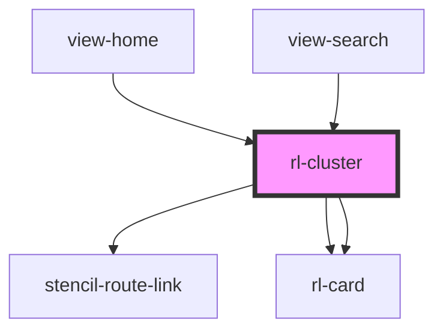

# rl-cluster

<!-- Auto Generated Below -->

## Properties

| Property   | Attribute   | Description | Type                         | Default     |
| ---------- | ----------- | ----------- | ---------------------------- | ----------- |
| `columns`  | `columns`   |             | `number`                     | `2`         |
| `data`     | --          |             | `ClusterData[] \| undefined` | `undefined` |
| `hasMore`  | `has-more`  |             | `boolean`                    | `false`     |
| `heading`  | `heading`   |             | `string`                     | `''`        |
| `isMobile` | `is-mobile` |             | `boolean`                    | `false`     |
| `parentEl` | --          |             | `HTMLElement \| undefined`   | `undefined` |

## Dependencies

### Used by

 - [view-home](../../views/view-home)
 - [view-search](../../views/view-search)

### Depends on

- stencil-route-link
- [rl-card](../card)
- [rl-card](../card)

### Graph

----------------------------------------------

*Built with [StencilJS](https://stenciljs.com/)*
