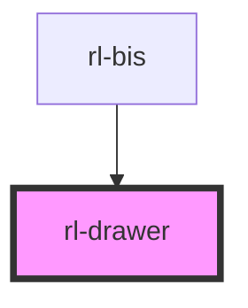

# rl-drawer

<!-- Auto Generated Below -->

## Properties

| Property            | Attribute | Description                            | Type      | Default     |
| ------------------- | --------- | -------------------------------------- | --------- | ----------- |
| `open` _(required)_ | `open`    | Flag indicating if the drawer is open. | `boolean` | `undefined` |

## Events

| Event         | Description                               | Type               |
| ------------- | ----------------------------------------- | ------------------ |
| `drawerClose` | An event emitted when this drawer closes. | `CustomEvent<any>` |

## Dependencies

### Used by

 - [rl-bis](../../app)

### Graph

----------------------------------------------

*Built with [StencilJS](https://stenciljs.com/)*
