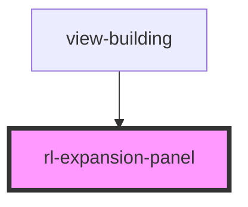

# rl-expansion-panel

<!-- Auto Generated Below -->

## Properties

| Property | Attribute | Description | Type     | Default |
| -------- | --------- | ----------- | -------- | ------- |
| `index`  | `index`   |             | `number` | `0`     |

## Events

| Event     | Description | Type               |
| --------- | ----------- | ------------------ |
| `toggled` |             | `CustomEvent<any>` |

## Methods

### `close() => Promise<void>`

#### Returns

Type: `Promise<void>`

### `open() => Promise<void>`

#### Returns

Type: `Promise<void>`

## Dependencies

### Used by

 - [view-building](../../views/view-building)

### Graph

----------------------------------------------

*Built with [StencilJS](https://stenciljs.com/)*
