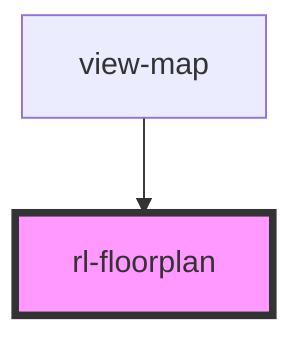

# rl-floorplan

<!-- Auto Generated Below -->

## Properties

| Property           | Attribute     | Description                                                  | Type                                                          | Default       |
| ------------------ | ------------- | ------------------------------------------------------------ | ------------------------------------------------------------- | ------------- |
| `activeId`         | `active-id`   | The ID of the active (selected) element.                     | `string`                                                      | `''`          |
| `extraElementData` | --            |                                                              | `undefined \| { [key: string]: { [key: string]: string; }; }` | `undefined`   |
| `floorId`          | `floor-id`    | The ID of the floorplan to display.                          | `string \| undefined`                                         | `undefined`   |
| `height`           | `height`      | The height for the SVG element.                              | `string`                                                      | `'2400'`      |
| `useOrtho`         | `use-ortho`   | Setting to use the orthographic variant of the floorplan.    | `boolean`                                                     | `false`       |
| `useViewbox`       | `use-viewbox` | Setting to true adds a viewbox attribute to the SVG element. | `boolean`                                                     | `false`       |
| `vbHeight`         | `vb-height`   | The width of the SVG viewbox.                                | `string`                                                      | `this.height` |
| `vbWidth`          | `vb-width`    | The height of the SVG viewbox.                               | `string`                                                      | `this.width`  |
| `width`            | `width`       | The width for the SVG element.                               | `string`                                                      | `'4800'`      |

## Events

| Event              | Description                                                                                                              | Type                  |
| ------------------ | ------------------------------------------------------------------------------------------------------------------------ | --------------------- |
| `rlElementCleared` | Event fired when the SVG is clicked but no specific element is targeted, that is, the active element is cleared.         | `CustomEvent<void>`   |
| `rlElementClicked` | Event fired when an element in the SVG is clicked (if it is clickable). Details will be the `id` of the clicked element. | `CustomEvent<string>` |

## Dependencies

### Used by

 - [view-map](../../views/view-map)

### Graph

----------------------------------------------

*Built with [StencilJS](https://stenciljs.com/)*
