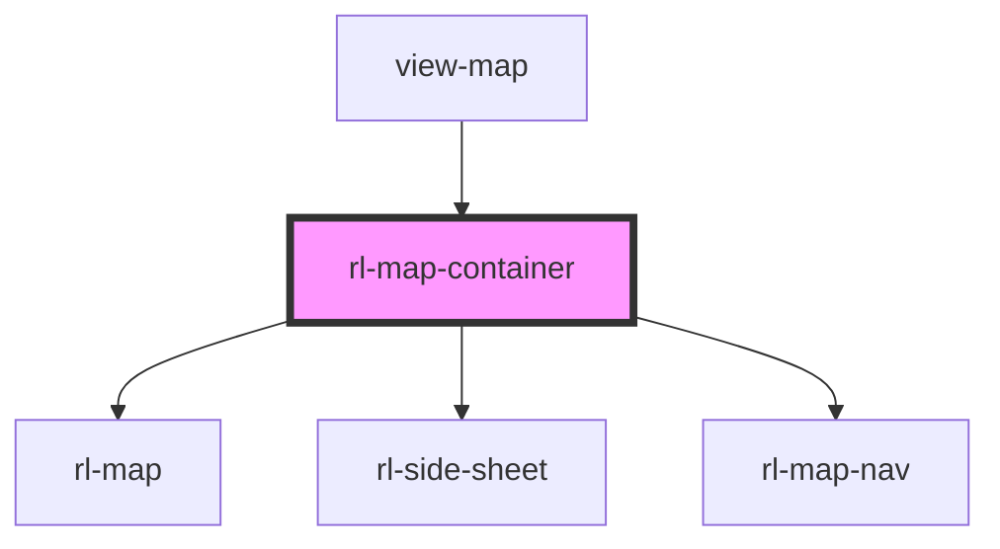

# map-container

<!-- Auto Generated Below -->

## Properties

| Property                       | Attribute          | Description | Type                  | Default     |
| ------------------------------ | ------------------ | ----------- | --------------------- | ----------- |
| `buildings` _(required)_       | --                 |             | `BuildingMap`         | `undefined` |
| `extraDetails`                 | --                 |             | `undefined \| {}`     | `undefined` |
| `initialBuilding` _(required)_ | `initial-building` |             | `number`              | `undefined` |
| `initialElement`               | `initial-element`  |             | `number \| undefined` | `undefined` |
| `initialFloor` _(required)_    | `initial-floor`    |             | `number`              | `undefined` |

## Methods

### `setActiveElement(el: MapElementData) => Promise<void>`

#### Returns

Type: `Promise<void>`

## Dependencies

### Used by

 - [view-map](../../views/view-map)

### Depends on

- rl-map
- [rl-side-sheet](../site-sheet)
- [rl-map-nav](../map-nav)

### Graph

----------------------------------------------

*Built with [StencilJS](https://stenciljs.com/)*
