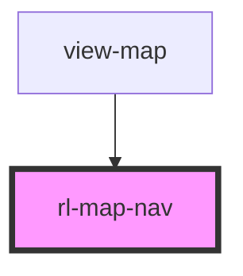

# rl-map-nav

<!-- Auto Generated Below -->

## Properties

| Property                        | Attribute            | Description                                | Type          | Default     |
| ------------------------------- | -------------------- | ------------------------------------------ | ------------- | ----------- |
| `activeBuildingId` _(required)_ | `active-building-id` | The `id` of the currently active building. | `number`      | `undefined` |
| `activeFloorId` _(required)_    | `active-floor-id`    | The `id` of the currently active floor.    | `number`      | `undefined` |
| `buildings` _(required)_        | --                   | An id-indexed map of the buildings.        | `BuildingMap` | `undefined` |
| `floors` _(required)_           | --                   | An id-indexed map of floors.               | `FloorMap`    | `undefined` |

## Events

| Event             | Description                                          | Type               |
| ----------------- | ---------------------------------------------------- | ------------------ |
| `buildingChanged` | An event emitted when the selected Building changes. | `CustomEvent<any>` |
| `floorChanged`    | An event emitted when the selected Floor changes.    | `CustomEvent<any>` |

## Dependencies

### Used by

 - [view-map](../../views/view-map)

### Graph

----------------------------------------------

*Built with [StencilJS](https://stenciljs.com/)*
