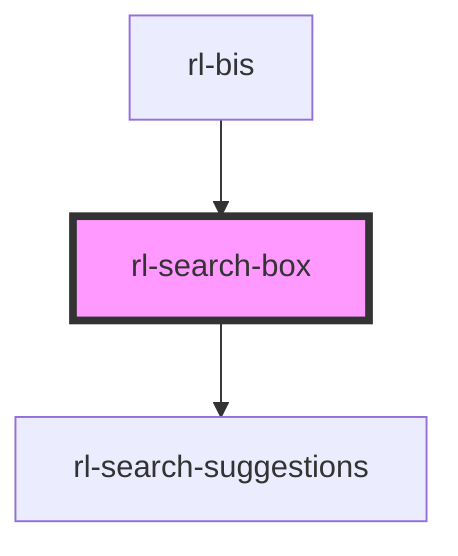

# rl-search-box

<!-- Auto Generated Below -->

## Properties

| Property                 | Attribute       | Description | Type                         | Default     |
| ------------------------ | --------------- | ----------- | ---------------------------- | ----------- |
| `docSearch` _(required)_ | --              |             | `Search`                     | `undefined` |
| `history`                | --              |             | `RouterHistory \| undefined` | `undefined` |
| `placeholder`            | `placeholder`   |             | `string`                     | `'Search'`  |
| `resultHeight`           | `result-height` |             | `number`                     | `0`         |
| `searchValue`            | `search-value`  |             | `string`                     | `''`        |
| `showMenu`               | `show-menu`     |             | `boolean`                    | `false`     |

## Events

| Event          | Description | Type               |
| -------------- | ----------- | ------------------ |
| `iconClick`    |             | `CustomEvent<any>` |
| `searchChange` |             | `CustomEvent<any>` |

## Methods

### `clearInput() => Promise<void>`

#### Returns

Type: `Promise<void>`

## Dependencies

### Used by

 - [rl-bis](../../app)

### Depends on

- [rl-search-suggestions](../search-suggestions)

### Graph

----------------------------------------------

*Built with [StencilJS](https://stenciljs.com/)*
