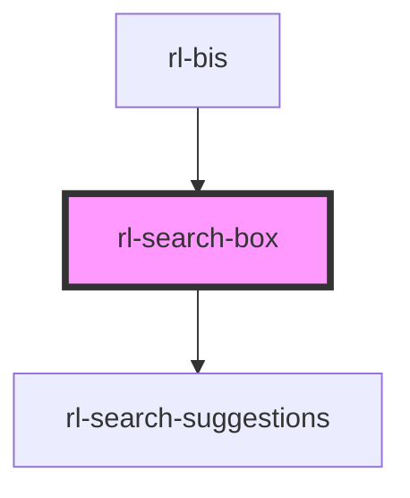

# rl-search-box

<!-- Auto Generated Below -->

## Properties

| Property                 | Attribute      | Description                                                                                                                                                                               | Type                         | Default     |
| ------------------------ | -------------- | ----------------------------------------------------------------------------------------------------------------------------------------------------------------------------------------- | ---------------------------- | ----------- |
| `docSearch` _(required)_ | --             | The object used to perform text searches.                                                                                                                                                 | `Search`                     | `undefined` |
| `history`                | --             | Reference to the Stencil history object.                                                                                                                                                  | `RouterHistory \| undefined` | `undefined` |
| `placeholder`            | `placeholder`  | Placeholder text for when the input is empty.                                                                                                                                             | `string`                     | `'Search'`  |
| `searchValue`            | `search-value` | The current value of the search input.                                                                                                                                                    | `string`                     | `''`        |
| `showMenu`               | `show-menu`    | Flag indicating if the menu icon should be displayed instead of the search icon.  This is needed when the search box extends the entire app bar and there is no room for the drawer icon. | `boolean`                    | `false`     |

## Events

| Event          | Description                                                                                                  | Type               |
| -------------- | ------------------------------------------------------------------------------------------------------------ | ------------------ |
| `iconClick`    | Event fired when the user clicks the search/menu icon.  This is needed to allow the menu to open the drawer. | `CustomEvent<any>` |
| `searchChange` | Event fired when the text input is changed.                                                                  | `CustomEvent<any>` |

## Methods

### `clearInput() => Promise<void>`

Clear the current input value.

#### Returns

Type: `Promise<void>`

## Dependencies

### Used by

 - [rl-bis](../../app)

### Depends on

- [rl-search-suggestions](../search-suggestions)

### Graph

----------------------------------------------

*Built with [StencilJS](https://stenciljs.com/)*
