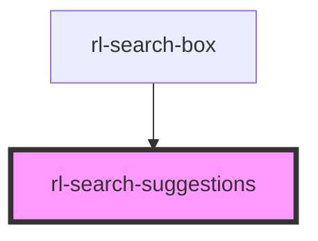

# rl-search-suggestions

<!-- Auto Generated Below -->

## Properties

| Property        | Attribute         | Description | Type                  | Default     |
| --------------- | ----------------- | ----------- | --------------------- | ----------- |
| `activeResult`  | `active-result`   |             | `number \| undefined` | `undefined` |
| `isEmptySearch` | `is-empty-search` |             | `boolean`             | `true`      |
| `suggestions`   | --                |             | `SearchResultItem[]`  | `[]`        |

## Events

| Event               | Description | Type               |
| ------------------- | ----------- | ------------------ |
| `suggestionClicked` |             | `CustomEvent<any>` |

## Dependencies

### Used by

 - [rl-search-box](../search-box)

### Graph

----------------------------------------------

*Built with [StencilJS](https://stenciljs.com/)*
