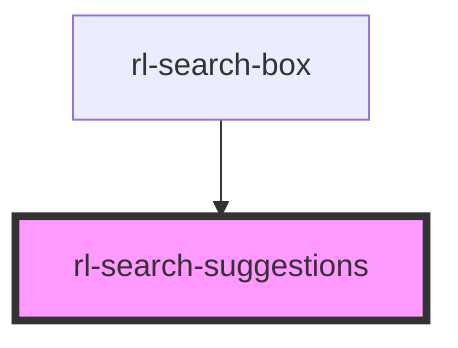

# rl-search-suggestions

<!-- Auto Generated Below -->

## Properties

| Property        | Attribute         | Description                                                                               | Type                  | Default     |
| --------------- | ----------------- | ----------------------------------------------------------------------------------------- | --------------------- | ----------- |
| `activeResult`  | `active-result`   | The currently active/highlighted/focused search suggestion.                               | `number \| undefined` | `undefined` |
| `isEmptySearch` | `is-empty-search` | Flag indicating if there are no search suggestions (even though there is a search query). | `boolean`             | `true`      |
| `suggestions`   | --                | The list of search suggestions.                                                           | `SearchResultItem[]`  | `[]`        |

## Events

| Event               | Description                                                      | Type                            |
| ------------------- | ---------------------------------------------------------------- | ------------------------------- |
| `suggestionClicked` | Event fired when the user selects one of the search suggestions. | `CustomEvent<SearchResultItem>` |

## Dependencies

### Used by

 - [rl-search-box](../search-box)

### Graph

----------------------------------------------

*Built with [StencilJS](https://stenciljs.com/)*
