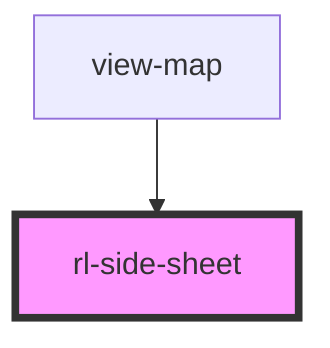

# rl-detail-panel

<!-- Auto Generated Below -->

## Properties

| Property | Attribute | Description | Type      | Default |
| -------- | --------- | ----------- | --------- | ------- |
| `open`   | `open`    |             | `boolean` | `false` |

## Events

| Event    | Description                                             | Type               |
| -------- | ------------------------------------------------------- | ------------------ |
| `closed` | Event fired when the `side-sheet` has finished closing. | `CustomEvent<any>` |
| `opened` | Event fired when the `side-sheet` has finished opening. | `CustomEvent<any>` |

## Dependencies

### Used by

 - [view-map](../../views/view-map)

### Graph

----------------------------------------------

*Built with [StencilJS](https://stenciljs.com/)*
