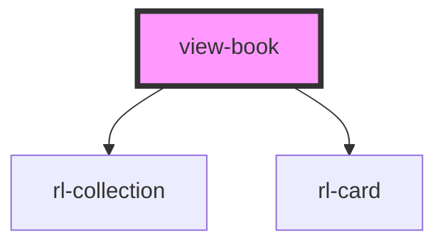

# view-home

<!-- Auto Generated Below -->

## Properties

| Property               | Attribute    | Description | Type            | Default     |
| ---------------------- | ------------ | ----------- | --------------- | ----------- |
| `appLoaded`            | `app-loaded` |             | `boolean`       | `false`     |
| `history` _(required)_ | --           |             | `RouterHistory` | `undefined` |

## Dependencies

### Depends on

- [rl-collection](../../components/collection)
- [rl-card](../../components/card)

### Graph

----------------------------------------------

*Built with [StencilJS](https://stenciljs.com/)*
