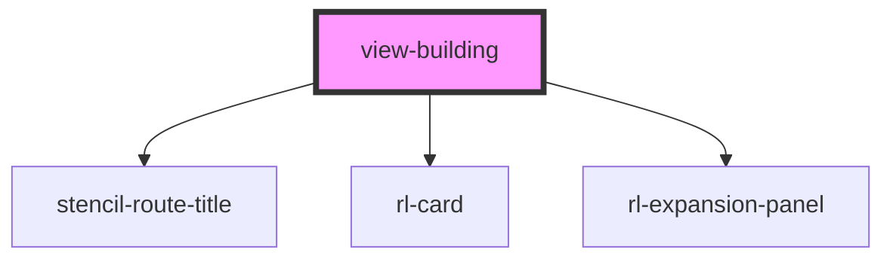

# view-building

<!-- Auto Generated Below -->

## Properties

| Property               | Attribute    | Description                                                                                                                        | Type            | Default     |
| ---------------------- | ------------ | ---------------------------------------------------------------------------------------------------------------------------------- | --------------- | ----------- |
| `appLoaded`            | `app-loaded` | Global flag indicating if the whole application has loaded.  If not, this view should not display either.                          | `boolean`       | `false`     |
| `history` _(required)_ | --           | Reference to the stencil-router history object. Used to programmatically change the browser history when the selected FAQ changes. | `RouterHistory` | `undefined` |

## Dependencies

### Depends on

- stencil-route-title
- [rl-card](../../components/card)
- [rl-expansion-panel](../../components/expansion-panel)

### Graph

----------------------------------------------

*Built with [StencilJS](https://stenciljs.com/)*
