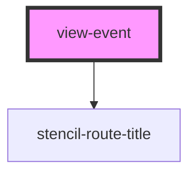

# view-event

<!-- Auto Generated Below -->

## Properties

| Property               | Attribute    | Description                                                                                               | Type            | Default     |
| ---------------------- | ------------ | --------------------------------------------------------------------------------------------------------- | --------------- | ----------- |
| `appLoaded`            | `app-loaded` | Global flag indicating if the whole application has loaded.  If not, this view should not display either. | `boolean`       | `false`     |
| `history` _(required)_ | --           |                                                                                                           | `RouterHistory` | `undefined` |

## Dependencies

### Depends on

- stencil-route-title

### Graph

----------------------------------------------

*Built with [StencilJS](https://stenciljs.com/)*
