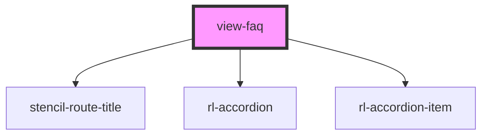

# view-faq

<!-- Auto Generated Below -->

## Properties

| Property               | Attribute    | Description                                                                                                                        | Type            | Default     |
| ---------------------- | ------------ | ---------------------------------------------------------------------------------------------------------------------------------- | --------------- | ----------- |
| `appLoaded`            | `app-loaded` | Global flag indicating if the whole application has loaded.  If not, this view should not display either.                          | `boolean`       | `false`     |
| `history` _(required)_ | --           | Reference to the stencil-router history object. Used to programmatically change the browser history when the selected FAQ changes. | `RouterHistory` | `undefined` |
| `match` _(required)_   | --           | Reference to the object passed in from Stencil containing any URL path variables that were matched by the router.                  | `MatchResults`  | `undefined` |

## Methods

### `setActiveFaq(faqId: number) => Promise<void>`

#### Returns

Type: `Promise<void>`

## Dependencies

### Depends on

- stencil-route-title
- [rl-accordion](../../components/accordion)
- [rl-accordion-item](../../components/accordion-item)

### Graph

----------------------------------------------

*Built with [StencilJS](https://stenciljs.com/)*
