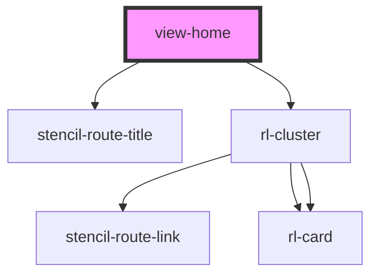

# view-home

<!-- Auto Generated Below -->

## Properties

| Property               | Attribute         | Description                                                                                                                        | Type            | Default     |
| ---------------------- | ----------------- | ---------------------------------------------------------------------------------------------------------------------------------- | --------------- | ----------- |
| `appLoaded`            | `app-loaded`      |                                                                                                                                    | `boolean`       | `false`     |
| `clusterColumns`       | `cluster-columns` |                                                                                                                                    | `number`        | `2`         |
| `history` _(required)_ | --                | Reference to the stencil-router history object. Used to programmatically change the browser history when the selected FAQ changes. | `RouterHistory` | `undefined` |
| `isMobile`             | `is-mobile`       |                                                                                                                                    | `boolean`       | `false`     |

## Dependencies

### Depends on

- stencil-route-title
- [rl-cluster](../../components/cluster)

### Graph

----------------------------------------------

*Built with [StencilJS](https://stenciljs.com/)*
