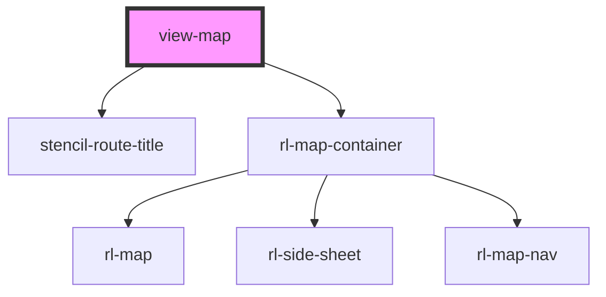

# view-map

<!-- Auto Generated Below -->

## Properties

| Property               | Attribute    | Description                                                                                                                        | Type                                                         | Default              |
| ---------------------- | ------------ | ---------------------------------------------------------------------------------------------------------------------------------- | ------------------------------------------------------------ | -------------------- |
| `appLoaded`            | `app-loaded` | A global flag passed in to indicate if the application has loaded as well.                                                         | `boolean`                                                    | `false`              |
| `history` _(required)_ | --           | Reference to the stencil-router history object. Used to programmatically change the browser history when the selected FAQ changes. | `RouterHistory`                                              | `undefined`          |
| `mapType`              | `map-type`   |                                                                                                                                    | `MAP_TYPE.BOOKS \| MAP_TYPE.COMPUTERS \| MAP_TYPE.DIRECTORY` | `MAP_TYPE.DIRECTORY` |
| `match` _(required)_   | --           | The results coming from `stencil-router` that contain any URL matches.                                                             | `MatchResults`                                               | `undefined`          |

## Events

| Event        | Description                                                          | Type               |
| ------------ | -------------------------------------------------------------------- | ------------------ |
| `dataLoaded` | Event fired when the data specific to this view is finished loading. | `CustomEvent<any>` |

## Methods

### `setActiveDetail(id: number) => Promise<void>`

#### Returns

Type: `Promise<void>`

### `setActiveElement(id: number) => Promise<void>`

#### Returns

Type: `Promise<void>`

## Dependencies

### Depends on

- stencil-route-title
- [rl-map-container](../../components/map-container)

### Graph

----------------------------------------------

*Built with [StencilJS](https://stenciljs.com/)*
