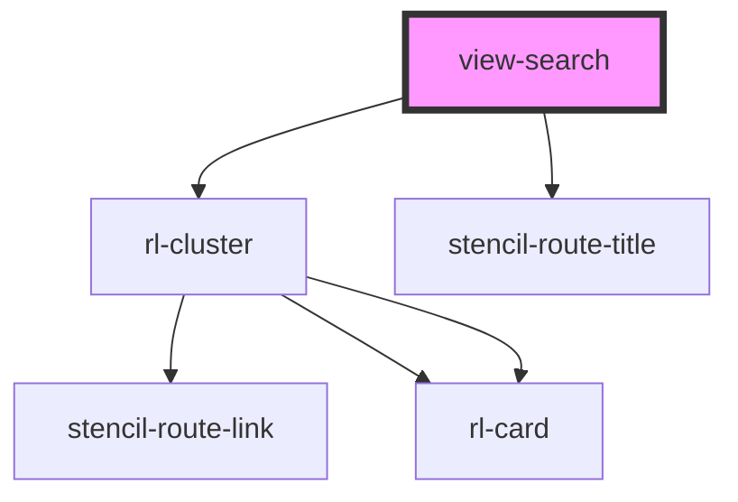

# view-home

<!-- Auto Generated Below -->

## Properties

| Property               | Attribute         | Description | Type                  | Default     |
| ---------------------- | ----------------- | ----------- | --------------------- | ----------- |
| `appLoaded`            | `app-loaded`      |             | `boolean`             | `false`     |
| `clusterColumns`       | `cluster-columns` |             | `number`              | `2`         |
| `history` _(required)_ | --                |             | `RouterHistory`       | `undefined` |
| `isMobile`             | `is-mobile`       |             | `boolean`             | `false`     |
| `match` _(required)_   | --                |             | `MatchResults`        | `undefined` |
| `searchUrl`            | `search-url`      |             | `string \| undefined` | `undefined` |

## Dependencies

### Depends on

- [rl-cluster](../../components/cluster)
- stencil-route-title

### Graph

----------------------------------------------

*Built with [StencilJS](https://stenciljs.com/)*
